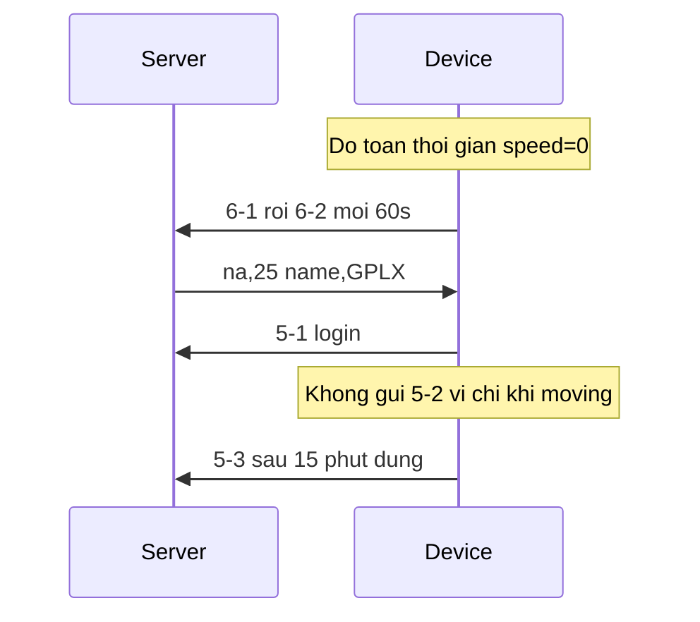
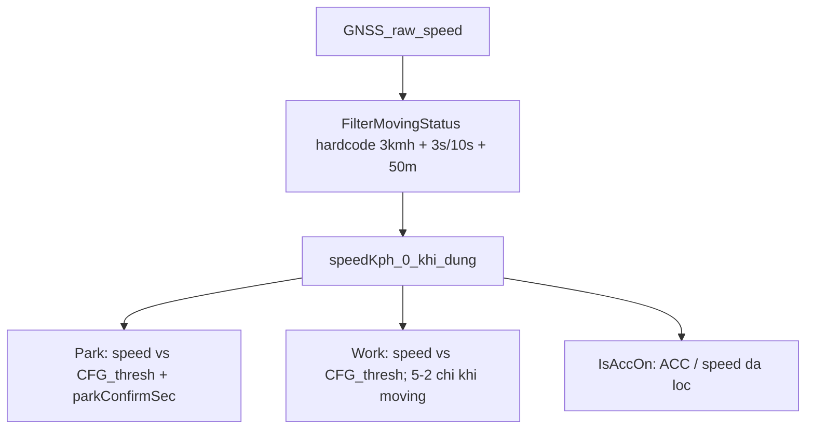

# Tối ưu logic chương trình (theo phân tích code + log)

## Bằng chứng log `Log 24-Thg7-26 11;18;04.txt` (FW `v1.0.260724b`)

~4687 dòng, xe **đứng yên toàn phiên**:

| Quan sát | Chi tiết |
|----------|----------|
| Stack CMD | `na,25` → Flush → `SET code=25` → **5-1** → Reply 13 — **không reset** (khác log 09:02) |
| Tin 6 | 6-1 lúc ~10:30; 6-2 mỗi 60s; tên lái xe đổi sau `na,25` |
| Tin 5-1 | `10:42:59` sau `na,25` — OK; status tin 2 `263→295` (+`ST_DRIVER`) |
| Tin 5-2 | **Không có** suốt ~15 phút phiên (xe đỗ, `moving=0`) |
| Tin 5-3 | `10:58:00` (~15 phút sau login) — LXLT=15, LXTN=15 — OK |
| GPS URC | **~2968 dòng (~63%)** — cần giảm |
| EN25 | Vẫn fail; CFG vẫn log “SPI Flash & EFS OK” |

**Kết luận từ log:** ưu tiên sửa **5-2 khi phiên còn mở**; stack CMD coi như đã ổn ở 260724b (vẫn củng cố static frame); giảm URC spam; flash/status trung thực.

## Vấn đề logic hiện tại

| Lớp | Logic | Hệ quả (khớp log) |
|-----|-------|-------------------|
| GPS filter | `speed > 3.0` cố định | Đỗ → `speedKph=0` |
| Tin 6 | So lại thresh + confirm 60s | 6-1/6-2 chạy đúng khi đỗ |
| Tin 5 | 5-2 chỉ khi `moving` | Login bằng CMD rồi đứng → **không 5-2** |
| Tin 5 logout | Dừng ≥ 900s | 5-3 đúng sau 15 phút |

## Hướng tối ưu (ưu tiên theo log)

### 1. Tin 5 — sửa ngay theo log 11:18

Trong [`app_nasa.c`](app_nasa.c) `NASA_WorkUpdate`:

- **5-2:** mỗi `WORK_PERIODIC_SEC` khi `s_workActive` (kể cả `!moving` / stop pending), không chỉ khi đang chạy.
- **5-3:** giữ sau 15 phút `!moving` liên tục (đã verify).
- **5-1 auto:** cạnh `!moving→moving` qua `GPS_IsMoving()`; CMD `na,14`/`na,25` giữ như hiện tại.

### 2. Một nguồn chạy/dừng: `GPS_IsMoving()`

[`app_gps.c`](app_gps.c): thresh = `CFG_GetSpeedThresh()`; export `GPS_IsMoving()`.

[`app_nasa.c`](app_nasa.c): Park/Work/`IsAccOn` mode 0/2 dùng cờ này.

### 3. Tin 6 — tách confirm / chu kỳ

- Confirm vào đỗ: `STOPPED_CONFIRM_SEC` (khớp GPS).
- Chu kỳ 6-2: `CFG_GetParkConfirmSec()` (cmd 26, default 60) — bỏ hardcode.

### 4. Ổn định / flash / log

- Static frame Park/Work; Reply mutex (phòng stack khi CMD nặng).
- `EN25_IsReady`; `ST_FLASH_OK` đúng; dirty-save `driverLoggedIn`.
- Rate-limit/tắt raw `GPS URC` (giảm ~60% dung lượng log).

### 5. Verify (`v1.0.260724c`)

Kịch bản giống log 11:18 (đỗ + `na,25`):

- [ ] 5-1 + Reply 13, không reset
- [ ] **5-2 mỗi ~60s** trong lúc vẫn đỗ / phiên mở
- [ ] 5-3 sau ~15 phút đứng
- [ ] 6-2 tiếp tục; status có `ST_DRIVER` khi login
- [ ] Log URC giảm rõ

## File chính

- [`app_nasa.c`](app_nasa.c) — 5-2 / Park / Work
- [`app_gps.c`](app_gps.c) / [`app_gps.h`](app_gps.h)
- [`app_cmd.c`](app_cmd.c) / [`app_cfg.c`](app_cfg.c) / [`drv_en25qh64a.c`](drv_en25qh64a.c)
- [`sc_application.c`](sc_application.c) / [`app_config.h`](app_config.h)

## Ngoài phạm vi

- Backup tin 9
- Sửa hardware EN25
- Đổi protocol field tin 5/6
