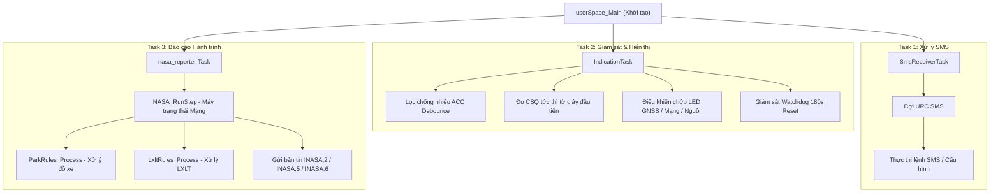
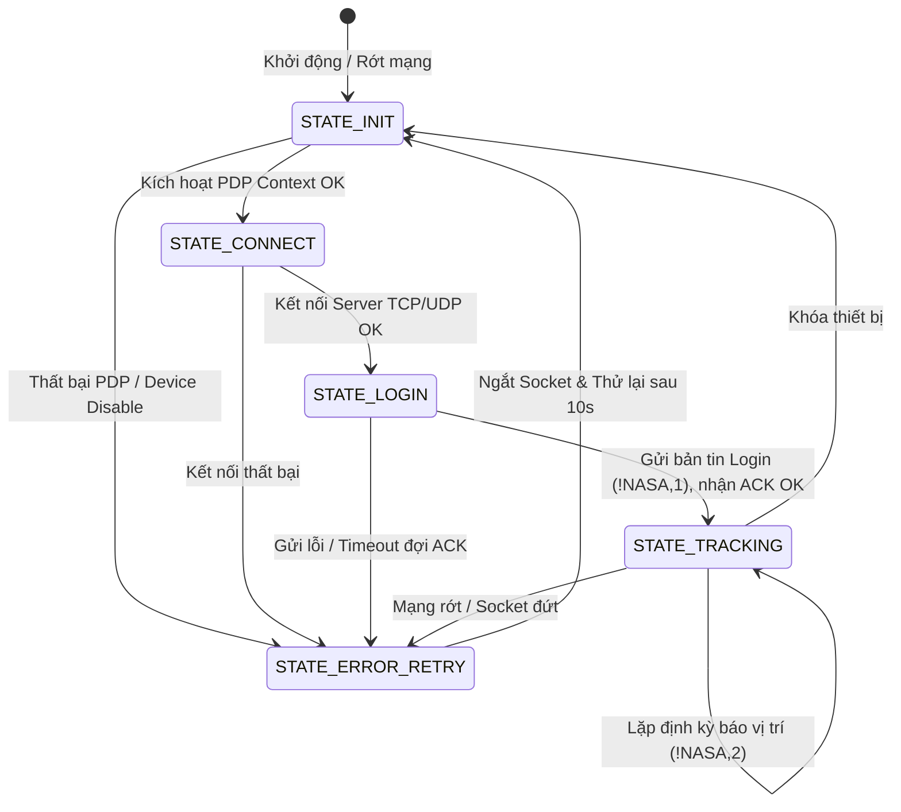
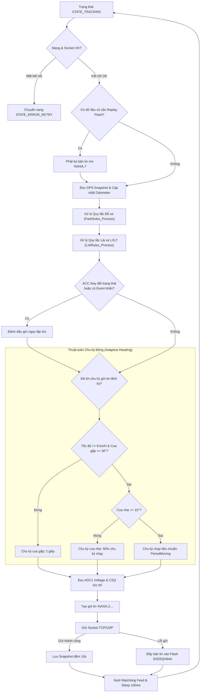

# Phân tích Logic & Cấu trúc Chương trình NASA Tracking (SIMCom A7677S)

Tài liệu mô tả chi tiết kiến trúc tổng quan, các tiến trình song song (Tasks), máy trạng thái báo cáo (State Machine), bộ quy tắc nghiệp vụ thuần túy (Pure C Rule Engines), và lớp trừu tượng phần cứng (HAL Layer) của Firmware định vị giám sát hành trình **NASA Tracking A7677S** (`NASA4G`, FW: `v1.0.260731`).

---

## 1. Cấu trúc Chương trình & Phân lớp Mô-đun (Software Architecture)

Firmware được thiết kế theo mô hình phân lớp nghiêm ngặt. Toàn bộ logic ứng dụng **không include trực tiếp SDK của SIMCom**, mà thông qua lớp trung gian **HAL (Hardware Abstraction Layer)**. Điều này cho phép dễ dàng kiểm thử Unit Test trực tiếp trên Host PC mà không cần nạp lên chip thực.

```text
NASA-TRACKING-A7677S/
├── sc_application.c         # Điểm neo chính (Main Entry: userSpace_Main) & Khởi tạo Task
├── app_nasa.c / .h          # Máy trạng thái báo cáo vị trí, duy trì Socket TCP/UDP
├── app_park_rules.c / .h    # Pure C Rule Engine: Quy tắc đỗ xe (Bản tin !NASA,6)
├── app_lxlt_rules.c / .h    # Pure C Rule Engine: Quy tắc lái xe liên tục LXLT & LXTN (Bản tin !NASA,5)
├── app_cmd.c / .h           # Bộ phân tích và thực thi lệnh SMS/Server (Mã lệnh 1..41)
├── app_indication.c / .h    # Task điều khiển LED trạng thái, lọc ACC & Watchdog Supervision
├── app_gps.c / .h           # Quản lý bộ đệm định vị GNSS & tính toán Odometer
├── app_cfg.c / .h           # Quản lý cấu hình lưu trong Flash
├── app_backup.c / .h        # Quản lý bộ đệm Flash EN25QH64A lưu dữ liệu điểm mù
├── app_sms.c / .h           # Quản lý xử lý SMS và tin nhắn FOTA
├── drv_en25qh64a.c / .h     # Driver điều khiển chip Flash SPI bên ngoài
│
├── hal/                     # LỚP TRỪU TƯỢNG PHẦN CỨNG (HAL INTERFACE)
│   ├── hal_os.h             # Thread, Task, Mutex, Queue, Sleep, Reset
│   ├── hal_net.h            # Socket TCP/UDP, PDP, CSQ, IMEI, ICCID
│   ├── hal_gnss.h           # NMEA, UTC Time, Satellite count
│   ├── hal_gpio.h           # GPIO ACC_IN, DOUT (Relay)
│   ├── hal_adc.h            # Đọc điện áp thực tế tại chân ADC1 (ADC.PWR)
│   ├── hal_spi.h            # Giao tiếp SPI Flash
│   ├── hal_fs.h / hal_sms.h # File system & SMS abstraction
│   └── impl/
│       └── hal_impl_simcom.c # CÀI ĐẶT DUY NHẤT gọi API của SIMCom SDK (sAPI_*)
│
└── tests/                   # BỘ UNIT TEST CHẠY TRÊN HOST PC (CTEST)
    ├── mocks/               # Giả lập Mock HAL (mock_hal_os, mock_hal_net, mock_hal_adc, ...)
    └── unit/                # Test tự động quy tắc đỗ xe & LXLT
```

---

## 2. Kiến trúc Tiến trình Song song (Tasks & Multi-threading)

Ứng dụng khởi động từ `userSpace_Main()` trong [sc_application.c](file:///e:/test/NASA-TRACKING-A7677S/sc_application.c), tiến hành khởi tạo bộ nhớ Flash, Cấu hình, GPS, SMS và Mạng. Sau đó khởi chạy 3 Task chính chạy song song:



### Chi tiết nhiệm vụ từng Task:

1. **`SmsReceiverTask`** (Priority: 18, Stack: 8KB):
   - Đăng ký nhận SMS URC từ modem. Khi nhận SMS đến, phân tích và thực thi lệnh cài đặt.
   - Giám sát trạng thái nâng cấp phần mềm FOTA qua SMS.

2. **`IndicationTask`** (Priority: 15, Stack: 4KB):
   - Chạy định kỳ **100ms**.
   - **Xử lý ACC**: Khử nhiễu (debounce) chân vào ACC.
   - **Đo CSQ tức thì**: Khởi tạo `last_csq = 0` đo ngay chỉ số CSQ từ giây đầu khởi động mà không bị trễ 30s.
   - **Tín hiệu LED**: Chớp LED hiển thị trạng thái GNSS (Fix/No Fix), Mạng GSM (Online/Offline) và Nguồn.
   - **Giám sát Watchdog**: Đếm thời gian từ lần cuối `nasa_reporter` nuôi WDT (`s_lastWatchdogFeedTick`). Nếu quá **180 giây** mà `nasa_reporter` bị treo ➔ Tự động gọi `HAL_OS_SysReset()` để khôi phục thiết bị.

3. **`nasa_reporter` Task** (Priority: 10, Stack: 8KB):
   - Tiến trình chính vận hành hàm `NASA_RunStep()` theo máy trạng thái kết nối và báo cáo hành trình.

---

## 3. Máy Trạng Thái Mạng & Bộ Quy Tắc Nghiệp Vụ (Rule Engines)

### A. Máy Trạng Thái Mạng (`NASA_RunStep`)

Quản lý luồng kết nối mạng qua 5 trạng thái:



### B. Các Module Quy Tắc Thuần Túy (Pure C Rule Engines)

Logic kiểm định quy chuẩn giao thông được tách thành 2 module C độc lập:

1. **Park Rules Engine ([app_park_rules.c](file:///e:/test/NASA-TRACKING-A7677S/app_park_rules.c))**:
   - Quản lý trạng thái đỗ xe (`ParkState_t`).
   - Phát sinh các sự kiện đỗ xe gửi lên Server dạng bản tin **`!NASA,6`**:
     * `6-1`: Bắt đầu dừng/đỗ xe.
     * `6-2`: Đang dừng/đỗ xe (báo cáo định kỳ khi đỗ).
     * `6-3`: Kết thúc đỗ xe (bắt đầu di chuyển lại).

2. **LXLT Rules Engine ([app_lxlt_rules.c](file:///e:/test/NASA-TRACKING-A7677S/app_lxlt_rules.c))**:
   - Quản lý phiên làm việc của tài xế (`LxltState_t`).
   - Kiểm tra vi phạm lái xe liên tục quá 4 giờ (`WORK_LXLT_LIMIT_MIN = 240` ➔ Cờ `ST_LXLT_VIOLATION`), tổng thời gian lái xe tích lũy trong ngày (LXTN) và tự động đăng xuất tài xế sau 15 phút dừng đỗ liên tục.
   - Phát sinh bản tin **`!NASA,5`**:
     * `5-1`: Đăng nhập / Bắt đầu ca làm việc.
     * `5-2`: Báo cáo tiến độ phiên làm việc định kỳ.
     * `5-3`: Đăng xuất / Kết thúc ca làm việc.

---

## 4. Đo Điện Áp Thực Tế (ADC1 - Channel 1)

Thiết bị đo trực tiếp điện áp nguồn ắc-quy xe thông qua kênh **ADC1 (`ADC.PWR`)**:

* **Mạch phần cứng**:
  * Trở cầu phân áp: $R_{306} = 220\text{ k}\Omega$, $R_{307} = 10\text{ k}\Omega$ (Tỷ lệ phân áp: $\frac{10}{220+10} = \frac{1}{23}$).
  * Điện áp tại chân chip $V_{\text{ADC1}} = \frac{V_{\text{POWER}}}{23}$.
* **Triển khai trong Code ([app_nasa.c](file:///e:/test/NASA-TRACKING-A7677S/app_nasa.c))**:
  ```c
  float NASA_GetVoltage(void)
  {
      /* Đọc mV thực tế tại chân ADC1 từ SIMCom SDK qua HAL */
      uint32_t adc_mv = HAL_ADC_ReadMv(1); 
      if (adc_mv == 0) return 12.0f; /* Fallback mặc định 12V */

      /* Quy đổi điện áp nguồn xe thực tế (POWER) = V_ADC1 * 23 */
      return ((float)adc_mv * 23.0f) / 1000.0f;
  }
  ```
* **Gửi lên Server**: Giá trị điện áp (Volts) được điền vào trường vị trí thứ 12 (`%.1f`) trong bản tin tracking **`!NASA,2`** và bản tin đệm mù **`!NASA,7`**.

---

## 5. Lưu Đồ Xử Lý Luồng Tracking & Adaptive Heading

Khi ở trạng thái `STATE_TRACKING`, ứng dụng tự động điều chỉnh chu kỳ phát dựa theo đường cua góc quay hướng (Adaptive Heading):



---

## 6. Danh Sách Mã Lệnh Cấu Hình & Truy Vấn (`app_cmd.c`)

Module `app_cmd.c` hỗ trợ 21 mã lệnh điều khiển qua tin nhắn SMS hoặc lệnh Server với tiền tố `na` (SET) và `sa` (GET):

* **`code 1`**: IP & Port Server (`na,1,IP,Port` / `sa,1`)
* **`code 2`**: Điều khiển Rơ-le `D_OUT` ngắt nguồn/nhiên liệu (`na,2,1|0` / `sa,2`)
* **`code 4`**: Tần suất phát bản tin Chạy/Dừng (`na,4,moving_sec,stop_sec` / `sa,4`)
* **`code 8`**: Chế độ phát hiện ACC dây/vận tốc (`na,8,mode` / `sa,8`)
* **`code 9`**: Khởi động lại thiết bị tức thì (`na,9`)
* **`code 10`**: Ngưỡng cảnh báo quá tốc độ (`na,10,speed` / `sa,10`)
* **`code 11`**: Chế độ im lặng Silent mode (`na,11,0|1` / `sa,11`)
* **`code 12`**: Yêu cầu truyền lại dữ liệu cũ từ Flash (`na,12,from,to`)
* **`code 14`**: Đăng nhập / Đăng xuất tài xế thủ công (`na,14`)
* **`code 17/18`**: Số điện thoại chủ xe Phone 1 & Phone 2 (`na,17,phone` / `na,18,phone`)
* **`code 25`**: Cấu hình Tên lái xe & Số GPLX (`na,25,name,license`)
* **`code 26`**: Thời gian xác nhận dừng đỗ xe (`na,26,sec`)
* **`code 27`**: Truy vấn tọa độ GPS hiện tại qua link Google Maps (`sa,27`)
* **`code 29`**: Truy vấn thông tin thiết bị tổng hợp (IMEI, ICCID, CSQ, Sắt, Server, ACC) (`sa,29`)
* **`code 32`**: Lịch tự động reset thiết bị theo ngày/giờ (`na,32,days,hour`)
* **`code 33`**: Nâng cấp phần mềm FOTA từ URL (`na,33,URL`)
* **`code 34/35`**: Xóa bộ nhớ đệm hành trình / Xóa toàn bộ dữ liệu (`na,34`, `na,35`)
* **`code 37`**: Chuyển tiếp tin nhắn SMS (`na,37,phone,msg`)
* **`code 40`**: Khóa / Mở khóa bảo vệ cấu hình (`na,40,open|close`)
* **`code 41`**: Khôi phục cài đặt gốc nhà sản xuất (Factory Reset) (`na,41`)
