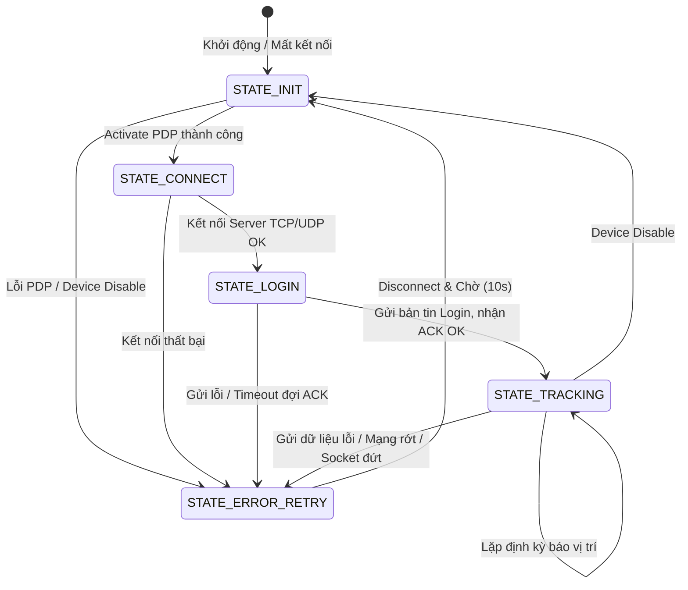
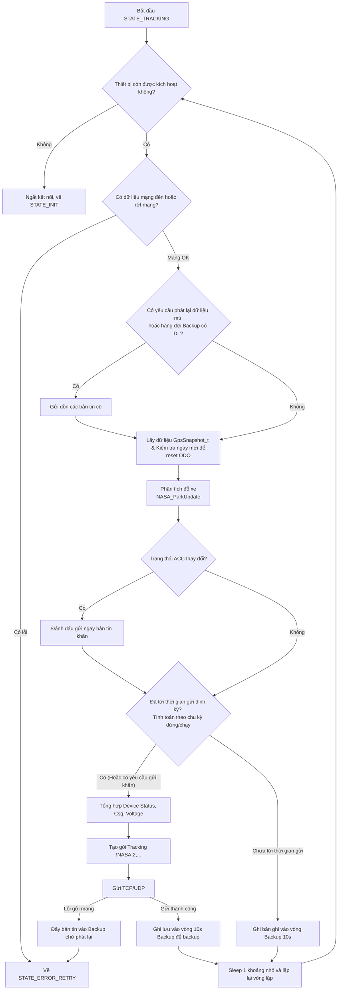

# Phân tích logic chức năng NASA Tracking (SIMCOM A7677S)

Dựa vào mã nguồn của chương trình trong thư mục không gian làm việc (`sc_application.c` và `app_nasa.c`), đây là một firmware định vị, giám sát hành trình (Tracking) liên lạc qua giao thức cấu trúc dạng bản tin `!NASA,...`. 

Chương trình được vận hành dựa trên các tiến trình song song (Tasks) và một máy trạng thái (State Machine) báo cáo dữ liệu định vị.

## 1. Kiến trúc Task (Tiến trình song song)
Khi ứng dụng khởi động từ điểm neo `userSpace_Main` (trong `sc_application.c`), nó khởi tạo các API, đọc cấu hình, chuẩn bị SMS, Mạng (Network) và GPS. Sau đó, nó tạo ra 3 task chính chạy độc lập:

1. **`SmsRecvTask`**: 
   - Chờ và nhận tin nhắn SMS thông qua URC.
   - Khi có tin nhắn đến, task sẽ đọc nội dung và gọi hàm thực thi cấu hình hoặc lệnh tương ứng thông qua `SMS_ExtractAndExecuteSmsBody()`.
2. **`gpio_status` Task**:
   - Chạy vòng lặp vô hạn theo chu kỳ 100ms.
   - Xử lý chống nhiễu (debounce) cho chân ACC (khóa điện).
   - Kiểm tra chất lượng mạng (CSQ) và báo trạng thái GNSS/Mạng/Nguồn thông qua các LED hiển thị theo các mức nháy khác nhau.
3. **`nasa_reporter` Task**:
   - Nhiệm vụ quan trọng nhất, chịu trách nhiệm kết nối lên server và gửi bản tin tracking.
   - Trong task này, hàm `NASA_RunStep()` được gọi liên tục trong một vòng lặp vô hạn để vận hành một **Máy trạng thái (State Machine)**.

---

## 2. Máy trạng thái báo cáo (NASA_RunStep)
Logic báo cáo hành trình nằm ở hàm `NASA_RunStep()` trong `app_nasa.c`. Nó được chia thành 5 trạng thái: `STATE_INIT`, `STATE_CONNECT`, `STATE_LOGIN`, `STATE_TRACKING` và `STATE_ERROR_RETRY`.

### Lưu đồ giải thuật báo cáo hành trình

---

## 3. Lưu đồ chi tiết vòng lặp TRACKING
Khi thiết bị ở trạng thái `STATE_TRACKING`, nó sẽ hoạt động theo quy trình như sau:

### Giải thích các khối nghiệp vụ chính trong TRACKING:
- **Chu kỳ động (Adaptive Period)**: Nếu ACC bật, thời gian gửi (Period) được điều chỉnh linh hoạt bằng thuật toán tính góc quay (Heading). Nếu xe vào cua ngoặt, nó sẽ giảm thời gian báo vị trí (tăng tần suất). Nếu xe đỗ, sẽ lấy chu kỳ `PeriodStopped`.
- **Dữ liệu điểm mù (Backup)**: Bất cứ bản tin nào lỗi gửi (do mất sóng, rớt mạng) đều được đẩy vào hệ thống lưu trữ dự phòng `Backup_Push`. Các bản tin này sẽ được gửi dồn khi máy kết nối lại và vào được trạng thái `STATE_TRACKING`.
- **Phân tích đỗ xe (Park Update)**: Tính toán thông minh tốc độ xe và thời gian dừng. Gửi bản tin số 1 (Bắt đầu đỗ), số 2 (Đang đỗ định kỳ), và số 3 (Bắt đầu di chuyển lại).
- **Hàng rào thiết bị (Device Status)**: Các thông số như cảnh báo tốc độ, dòng điện yếu (Low Battery), đăng nhập tài xế, và trạng thái ACC được bitmask vào trường báo cáo.
