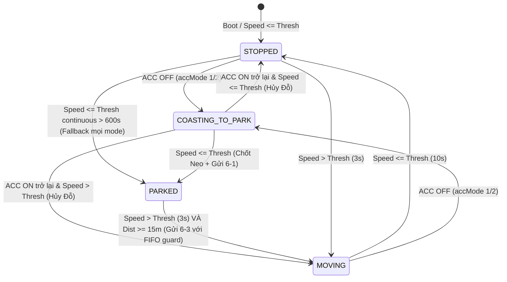

# Kế hoạch triển khai: Bộ Máy Trạng Thái Đỗ / Dừng Hoàn Chỉnh (Final Version)

Triển khai phân biệt rõ trạng thái **Đỗ (Parked)** và **Dừng tạm thời (Stopped)**, áp dụng cơ chế **Neo tọa độ (Stationary Anchor)** khi Đỗ, và **Bộ lọc khoảng cách dịch chuyển (Displacement Filter $\ge 15\text{m}$)** khi chuyển từ trạng thái Đỗ sang Chạy.

---

## 1. Giải Trình & Chốt Công Thức Logic Cho 5 Điểm Mới

### 1. Đường thoát từ `COASTING_TO_PARK` quay lại `MOVING / STOPPED` (Chống sụt áp/nhiễu ACC)
- **Vấn đề**: Khi ACC OFF (do dây lỏng hoặc sụt áp chập chờn 1-2s), hệ thống vào `COASTING_TO_PARK`. Nếu sau đó ACC bật lại (`ACC ON`) khi xe vẫn đang chạy:
- **Quy tắc**:
  - Nếu ở `COASTING_TO_PARK` mà tín hiệu `ACC ON` xuất hiện lại: **Lập tức HỦY tiến trình vào đỗ**, không chốt Neo, không gửi 6-1.
  - Nếu `speed > CFG_GetSpeedThresh()` -> Chuyển về **`MOVING`** (Odometer tiếp tục cộng km dồn bình thường).
  - Nếu `speed <= CFG_GetSpeedThresh()` -> Chuyển về **`STOPPED`**.

### 2. Công Thức Boolean Chính Xác Cho Các `accMode` (Config Cmd 8)
Quy định biểu thức logic Kích Hoạt Tiến Trình Đỗ (`TriggerParkSequence`):

Ký hiệu:
- `isWireAccOff` = (`!s_accWireOn` - tín hiệu ACC wire đã qua Debounce 6 chu kỳ).
- `isSpeedStopped` = (`speed <= CFG_GetSpeedThresh()` liên tục 10s).
- `isTimeoutParked` = (`speed <= CFG_GetSpeedThresh()` liên tục 600s / 10 phút).

Công thức:
- **`accMode == 0` (GPS Speed Only)**:
  $$\text{TriggerParkSequence} = \text{isTimeoutParked}$$
- **`accMode == 1` (Wire ACC Only + Safety Fallback)**:
  $$\text{TriggerParkSequence} = \text{isWireAccOff} \;\lor\; \text{isTimeoutParked}$$
- **`accMode == 2` (Hybrid ACC)**:
  $$\text{TriggerParkSequence} = (\text{isWireAccOff} \;\land\; \text{isSpeedStopped}) \;\lor\; \text{isTimeoutParked}$$

### 3. Fallback Timeout 600s Cho Mọi `accMode` (Lưới An Toàn Cảm Biến Hỏng)
- Áp dụng `isTimeoutParked` (dừng liên tục $\ge 600\text{s}$) làm **lưới an toàn chung cho cả 3 chế độ `accMode` (0, 1, 2)**.
- Đảm bảo nếu xe đứt dây ACC (ACC luôn báo ON giả) nhưng xe tắt máy đỗ thực tế $> 10\text{ phút}$, hệ thống vẫn tự động kích hoạt trạng thái Đỗ chuẩn xác.

### 4. Thứ Tự Hàng Chờ Gửi Bản Tin Mạng (FIFO Queue Order for 6-3 / 6-1)
- Quy tắc FIFO bảo toàn thứ tự thời gian thực trên Server:
  - Nếu bản tin 6-3 đang ở trạng thái hoãn chờ gửi (`s_pendingSend63 == 1`), mà xuất hiện sự kiện 6-1 mới:
    1. Tiến trình lập tức **xả và gửi bản tin 6-3 cũ trước**.
    2. Sau đó mới phát bản tin 6-1 mới.
  - Chuỗi bản tin gửi lên Server luôn bảo đảm đúng thứ tự thời gian: `... -> 6-1 (đỗ cũ) -> 6-3 (kết thúc đỗ cũ) -> 6-1 (bắt đầu đỗ mới)`.

### 5. Xác Nhận Debounce Tín Hiệu ACC Thô
- Tín hiệu `s_accWireOn` trong `app_gps.c` được cập nhật từ GPIO Task đã thông qua lọc nhiễu **`ACC_DEBOUNCE_CYCLES` (6 chu kỳ liên tiếp)** trong `app_config.h`. Đảm bảo không bị nhiễu điện ngắn xung vi mô.

---

## 2. Diagram Luồng Trạng Thái Hoàn Chỉnh

---

## Proposed Changes

### Configuration Layer

#### [MODIFY] [app_config.h](file:///e:/test/NASA-TRACKING-A7677S/app_config.h)
- Thêm `#define PARKED_CONFIRM_SEC 600` (10 phút = 600s xác nhận đỗ timeout).
- Thêm `#define PARK_FRAME_GUARD_SEC 5` (5s guard phát tin 6-3).
- Bổ sung comment chi tiết cho công thức boolean của `CFG_GetAccMode()`.

---

### GPS Engine Module

#### [MODIFY] [app_gps.h](file:///e:/test/NASA-TRACKING-A7677S/app_gps.h)
- Export `int GPS_IsParked(void)` để kiểm tra trạng thái Đỗ.

#### [MODIFY] [app_gps.c](file:///e:/test/NASA-TRACKING-A7677S/app_gps.c)
- **Cập nhật `FilterMovingStatus()` & `ApplyStationaryAnchor()`**:
  - Triển khai đầy đủ bộ máy trạng thái: `STOPPED`, `COASTING_TO_PARK`, `PARKED`, `MOVING`.
  - Áp dụng chuẩn công thức Boolean `TriggerParkSequence` cho từng `accMode`.
  - Xử lý đường hủy `COASTING_TO_PARK -> MOVING/STOPPED` khi `ACC ON` trở lại.
  - Áp dụng **Stationary Anchor** chốt tọa độ khi vào `PARKED`.
  - Khi ở `PARKED`, yêu cầu `speed > thresh` (3s) **VÀ** khoảng cách tới Neo $\ge 15\text{m}$ mới thoát Đỗ sang `MOVING`.
- **Cập nhật `UpdateOdometer()`**:
  - `!s_isMoving`: Cộng 0 km.
  - `s_isMoving`: Cộng km theo Haversine + Jump filter.

---

### Application / Protocol Layer

#### [MODIFY] [app_nasa.c](file:///e:/test/NASA-TRACKING-A7677S/app_nasa.c)
- **Đồng bộ `NASA_ParkUpdate()`**:
  - Phát 6-1 khi `GPS_IsParked()` = 1.
  - Phát 6-2 định kỳ 60s khi đang Đỗ.
  - Quản lý cờ `s_pendingSend63` với 5s guard và bảo đảm hàng chờ **FIFO** (luôn xả 6-3 cũ trước khi gửi 6-1 mới).

---

## Comprehensive Test Cases (TC1 -> TC7)

1. **TC1 (Tắt ACC khi rà phanh)**: Tắt ACC lúc 10km/h -> `COASTING_TO_PARK`, km ngừng cộng. Khi speed về 0km/h -> Chốt Neo, gửi 6-1.
2. **TC2 (Jitter / Kẹt xe nhích chậm)**: Tốc độ nhích 2-4km/h -> Bộ đếm 600s liên tục reset, không vào Parked.
3. **TC3 (Guard 5s & FIFO queue)**: Thoát đỗ (vọt xa >15m trong 3s) -> Trạng thái nội bộ sang `MOVING` (cộng km ngay), bản tin 6-3 được phát sau 5s guard theo đúng thứ tự FIFO.
4. **TC4 (Gating accMode)**: Test riêng từng chế độ `accMode` 0, 1, 2 theo đúng công thức Boolean.
5. **TC5 (Nhiễu sụt áp ACC khi đang chạy)**: ACC tắt 1s rồi bật lại khi xe đang chạy 40km/h -> Hệ thống vào `COASTING_TO_PARK` rồi lập tức quay về `MOVING`, không chốt Neo sai, không mất km.
6. **TC6 (accMode=2 Hybrid)**: ACC OFF khi xe đang chạy 60km/h -> Chờ đến khi speed <= thresh mới vào `PARKED` chốt Neo.
7. **TC7 (Dây ACC lỗi hỏng / Cố định ON)**: `accMode=1` nhưng dây ACC đứt (luôn báo ON) -> Xe dừng liên tục 600s -> Fallback tự động chuyển sang `PARKED`.
